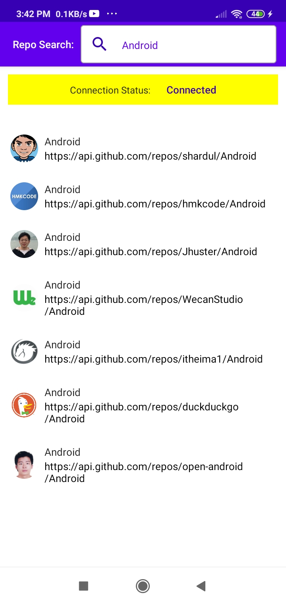
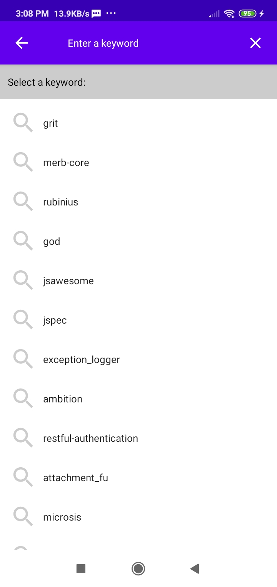
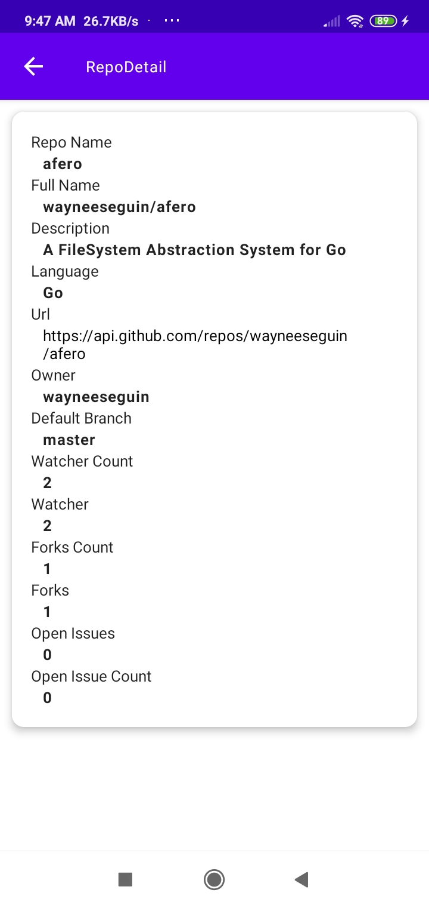
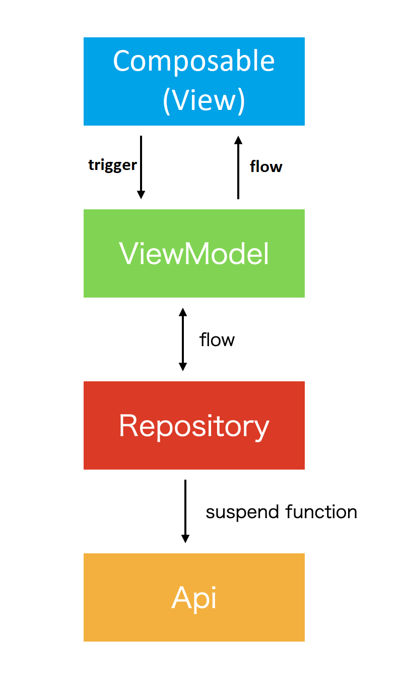

# Github RepoSearch
### Using Compose And Flow
A sample Github RepoSearch app using Android Compose as it's UI, Kotlin StateFlow &amp; SharedFlow as its data flow, Dagger Hilt as it's dependency injection, Room for offline cache and MVVM architect.
#### Key Features
****
The app cover the following features:
* Offline Cache
* Swipe to Refresh
* Error Handling
* Network check

## Apk link
Download RepoSearch app at [Google Drive ](https://drive.google.com/file/d/1VR5n7oMENmtyWMwccxCnP-k0XFnptZVI/view?usp=sharing).

## Screenshot
Watch screen flow in RepoSearch app at [youtube ](https://youtu.be/uoAo-_XJvdI).
repo search list|keyword suggestion list|repo detail
:--:|:--:|:--:
||

## Architecture


## SharedFlow usage in HomePage repo list suggestion
Call a ViewModel function, and emit to [MutableSharedFlow](https://kotlin.github.io/kotlinx.coroutines/kotlinx-coroutines-core/kotlinx.coroutines.flow/-mutable-shared-flow/).

After transformed to hot stream with [ViewModelScope](https://developer.android.com/topic/libraries/architecture/coroutines#viewmodelscope), 
collect safely it with collectAsStateLifecycleAware in Composable View.

```kotlin
@HiltViewModel
class RepoListPageViewModel @Inject constructor(

  savedStateHandle: SavedStateHandle,
  private val repository: RepoSearchBaseRepository,
  networkStatusDetector: NetworkStatusDetector,
  private val preferenceProvider: PreferenceProvider,
  private val application: Application

) :
  ViewModel() {

  private val tag: String = "RepoListPageViewModel"
  private val repoName: String = savedStateHandle.get<String>("repo_name").orEmpty()

  val searchText: MutableStateFlow<String> = MutableStateFlow(repoName)

  private var repoListNBRSharedFlow = MutableSharedFlow<Unit>()

  @Suppress("OPT_IN_IS_NOT_ENABLED")
  @OptIn(ExperimentalCoroutinesApi::class)
  var repoListNBR = repoListNBRSharedFlow
    .map {
      searchText.value
    }
    .flatMapLatest { repository.getRepoListNetworkBoundResource(it)}
    .stateIn(viewModelScope, SharingStarted.Eagerly, Resource.Start)


  @OptIn(FlowPreview::class)
  val networkState =
    networkStatusDetector.networkStatus
      .map (
        onAvailable = { NetworkConnectionState.Fetched },
        onUnavailable = { NetworkConnectionState.Error },
      )

  val isRefreshing: MutableStateFlow<Boolean> = MutableStateFlow(false)
  val showSearchTextEmptyToast: MutableStateFlow<Boolean> = MutableStateFlow(false)

  init {

    Log.e(tag, "init")
    Log.e(tag, "Argument: $repoName")
    Log.e(tag, "SearchText: ${searchText.value}")

    submit()

  }


  @OptIn(FlowPreview::class)
  fun submit() {
    Log.e(tag, "fetch RepoList")

    viewModelScope.launch {
      Log.e(tag, "in ViewModelScope")
      Log.e(tag, "preferenceKeyword: ${preferenceProvider.getSearchKeyword()}")
      if(searchText.value.isEmpty()){
        showSearchTextEmptyToast.value = true
      }else {
        showSearchTextEmptyToast.value = false
        if (preferenceProvider.getSearchKeyword() == searchText.value) {
          Log.e(tag, "Not Need connection")
          repoListNBRSharedFlow.emit(Unit)
        } else {
          if (CurrentNetworkStatus.getNetwork(application.applicationContext)) {
            repoListNBRSharedFlow.emit(Unit)
          } else {
            Log.e(tag, "Need connection")
          }
        }
      }


    }

  }

}

```

```kotlin
@OptIn(ExperimentalComposeUiApi::class)
@Composable
fun RepoListPage(
  navHostController: NavHostController,
  repoListPageViewModel: RepoListPageViewModel,
) {
  val searchText by repoListPageViewModel.searchText.collectAsStateLifecycleAware("")
  val repoListNBR by repoListPageViewModel.repoListNBR.collectAsStateLifecycleAware(Resource.Start)
  val networkState by repoListPageViewModel.networkState.collectAsStateLifecycleAware(NetworkConnectionState.Error)
  val isRefreshing by repoListPageViewModel.isRefreshing.collectAsStateLifecycleAware(false)
  val isShowSearchTextEmptyToast by repoListPageViewModel.showSearchTextEmptyToast.collectAsStateLifecycleAware(false)

  val isLoading: Boolean
  var errorMessage = ""
  var repoList: List<Repo> = listOf()
  val context = LocalContext.current
  val keyboardController = LocalSoftwareKeyboardController.current
  val needConnectionMessage = stringResource(id = R.string.need_connection_message)
  val keywordEmptyMessage = stringResource(id = R.string.keyword_empty)

  val isConnected: Boolean = when (networkState) {
    NetworkConnectionState.Fetched -> {
      Log.e(TAG, "Network Status: Fetched")
      true
    }
    else -> {
      Log.e(TAG, "Network Status: Error")
      false
    }
  }

  if(isShowSearchTextEmptyToast){
    Toast.makeText(
      context,
      keywordEmptyMessage,
      Toast.LENGTH_SHORT
    ).show()
    repoListPageViewModel.showSearchTextEmptyToastCollected()
  }

  when (repoListNBR) {
    Resource.Loading -> {
      Log.e(TAG, "RepoSearch Fetch Loading")
      isLoading = repoListNBR.isLoading
    }
    Resource.Fail("") -> {
      Log.e(TAG, "RepoSearch Fetch Fail")
      isLoading = false
      errorMessage = repoListNBR.errorMessage.orEmpty()
    }
    else -> {
      Log.e(TAG, "RepoSearch Fetch Success")
      isLoading = false
      repoList = repoListNBR.data.orEmpty()
      repoListPageViewModel.onDoneCollectResource()
    }
  }

}

```

## SharedFlow usage in KeywordSearchPage keyword list
Call a ViewModel function, and emit to [MutableSharedFlow](https://kotlin.github.io/kotlinx.coroutines/kotlinx-coroutines-core/kotlinx.coroutines.flow/-mutable-shared-flow/).

After transformed to hot stream with [ViewModelScope](https://developer.android.com/topic/libraries/architecture/coroutines#viewmodelscope),
collect safely it with collectAsStateLifecycleAware in Composable View.

```kotlin
@HiltViewModel
class KeywordSearchPageViewModel @Inject constructor(
  private val appRepository: AppRepository,
  savedStateHandle: SavedStateHandle,
) : ViewModel() {

  private val tag: String = "KeywordPageViewModel"
  private val repoName: String = savedStateHandle.get<String>("repo").orEmpty()

  val searchText: MutableStateFlow<String> = MutableStateFlow(repoName)


  private val keywordListShareFlow = MutableSharedFlow<Unit>()

  @Suppress("OPT_IN_IS_NOT_ENABLED")
  @OptIn(ExperimentalCoroutinesApi::class)
  var keywordListNBR = keywordListShareFlow
    .map { searchText.value }
    .flatMapLatest { appRepository.getKeywordListNetworkBoundResource(it) }
    .stateIn(viewModelScope, SharingStarted.Eagerly, Resource.Loading)

  init {

    Log.e(tag, "init")
    Log.e(tag, "Argument: $repoName")
    Log.e(tag, "SearchText: ${searchText.value}")

    submit()

  }
}


```
```kotlin

@Composable
fun KeywordSearchPage(navHostController: NavHostController, keywordSearchPageViewModel: KeywordSearchPageViewModel) {

  val searchText by keywordSearchPageViewModel.searchText.collectAsStateLifecycleAware(initial = "")
  val keywordListNBR by keywordSearchPageViewModel.keywordListNBR.collectAsStateLifecycleAware()

  var isLoading = false
  var errorMessage = ""
  var keywordList: List<Keyword> = listOf()


  when (keywordListNBR) {
    Resource.Loading -> {
      Log.e(TAG, "keywordListNBR Loading")
      isLoading = keywordListNBR.isLoading
    }
    Resource.Fail("") -> {
      Log.e(TAG, "keywordListNBR  Fail")
      errorMessage = keywordListNBR.errorMessage.orEmpty()
    }
    else -> {
      Log.e(TAG, "keywordListNBR Success")
      keywordList = keywordListNBR.data.orEmpty()
      when (keywordListNBR.data.isNullOrEmpty()) {
        true -> Log.e(TAG, "keyword list : NullOrEmpty")
        else -> {
          Log.e(TAG, "first keyword : ${keywordList.first().name}")
        }

      }

    }
  }
}

```
## Using Room and Network Bound Resource for offline cache 
Use Room database for offline storage and cache [Room](https://developer.android.com/training/data-storage/room/accessing-data) 

### RepoSearchDatabase
```kotlin
@Database(entities = [Repo::class, Owner::class, Keyword::class], version = 1, exportSchema = false)
abstract class RepoSearchDatabase() : RoomDatabase() {

  abstract fun repoDao(): RepoDao

  abstract fun ownerDao(): OwnerDao

  abstract fun repoDetailDao() : RepoDetailDao

  abstract fun keywordDao(): KeywordDao


}

```
### RepoDetail Table Dao
```kotlin

@Dao
abstract class RepoDetailDao: RepoDao, OwnerDao {

  fun insertToRepoDetail(repos: List<Repo>) {
    // delete previous data
    deleteAllRepos()
    deleteAllOwners()

    // save new data
    for (r in repos) {
      r.owner.repoId = r.id
      upsertOwner(r.owner)
    }
    insertReposToRepoDetail(repos)
  }

  fun getRepoDetail() : Flow<List<Repo>> {
    val repoDetail = _getAllFromRepoDetail()
    val repos: MutableList<Repo> = mutableListOf()
    for (i in repoDetail) {
      i.repo.owner = i.owner
      repos.add(i.repo)
    }
    Log.e("RepoDetailDao", "getRepos from RepoDetail: size ${repos.size}")
    return flow { emit(repos) }
  }

  fun getRepoDetailById(repoId: Long) : Flow<Repo> {
    val repoWithOwner = _getRepoDetailById(repoId)
    val repo = repoWithOwner.repo
    repo.owner = repoWithOwner.owner
    return flow { emit(repo) }
  }

  // insert or update if exists
  @Insert(onConflict = OnConflictStrategy.REPLACE)
  abstract fun upsertRepos(repos: List<Repo>)

  @Insert(onConflict = OnConflictStrategy.IGNORE)
  abstract fun insertReposToRepoDetail(repos: List<Repo>)

  @Transaction
  @Query("SELECT * FROM Repo, Owner WHERE Repo.id = Owner.repoId ORDER BY Repo.stargazersCount DESC")
  abstract fun _getAllFromRepoDetail() : List<RepoDetail>

  @Transaction
  @Query("SELECT * FROM Repo INNER JOIN Owner ON Owner.repoId = Repo.id WHERE Repo.id = :repoId")
  abstract fun _getRepoDetailById(repoId: Long) : RepoDetail

}

```
### Repo Table Dao
```kotlin
@Dao
interface RepoDao {

  @Insert(onConflict = OnConflictStrategy.REPLACE)
  suspend fun insertAll(repos: List<Repo>)

  @Query("DELETE FROM Repo")
  suspend fun deleteAll()

  @Query("SELECT * FROM Repo WHERE name IN (:repoNames)")
  fun getRepos(repoNames: String): Flow<List<Repo>>

  @Query("SELECT * FROM Repo WHERE name LIKE '%' || (:repoName) || '%'")
  fun getFilteredRepos(repoName: String?): Flow<List<Repo>>

  @Query("DELETE FROM Repo")
  abstract fun deleteAllRepos()


  @Insert(onConflict = OnConflictStrategy.REPLACE)
  abstract fun upsertRepo(vararg repo: Repo)
}

```
### Owner Table Dao
```kotlin
@Dao
interface OwnerDao {

  @Insert(onConflict = OnConflictStrategy.REPLACE)
  abstract fun upsertOwner(owner: Owner)

  @Query("DELETE FROM Owner")
  abstract fun deleteAllOwners()

}

```
### RepoSearch Repository with Network Bound Resource for offline cache
###Network Bound Resource  [Network Bound Resource](https://developer.android.com/topic/libraries/architecture/coroutines#viewmodelscope).
```kotlin
class RepoSearchRepository @Inject constructor(
  private val apiDataSource: RestDataSource,
  private val dbDataSource: RepoSearchDatabase,
  private val prefs: PreferenceProvider,
  private val appContext: Context
): RepoSearchBaseRepository {

  private val repoDetailDao = dbDataSource.repoDetailDao()

  override fun getRepoListNetworkBoundResource(s: String): Flow<Resource<List<Repo>>> {

    return repoSearchNetworkBoundResource(

      // make request
      fetchRemote = {
        Log.e("Repository", "fetchRemote()")
        apiDataSource.searchRepos(s, 50)
      },

      // extract data
      getDataFromResponse = {
        Log.e("Repository", "getDataFromResponse()")
        it.body()!!.items
      },

      // save data
      saveFetchResult = {
          repos ->
        Log.e("Repository", "saveFetchResult()")
        prefs.setSearchKeyword(s)
        repoDetailDao.insertToRepoDetail(repos)

      },

      // return saved data
      fetchLocal = {
        Log.e("Repository", "fetchLocal()")
        repoDetailDao.getRepoDetail()
      },

      // should fetch data from remote api or local db
      shouldFetch = {
        Log.e("Repository", "shouldFetch()")
        CurrentNetworkStatus.getNetwork(appContext)
      }


    ).flowOn(Dispatchers.IO)
  }


}

```


## Libraries
* [kotlin](https://kotlinlang.org/)
    * [kotlin coroutines](https://github.com/Kotlin/kotlinx.coroutines)
* [material-components](https://github.com/material-components/material-components-android)
* [coil](https://github.com/coil-kt/coil)
* [retrofit](https://github.com/square/retrofit)
* [okhttp](https://github.com/square/okhttp)
* [hilt](https://dagger.dev/hilt/)

### Reference Articles
  * [stateflow-vs-sharedflow_1](https://medium.com/androiddevelopers/a-safer-way-to-collect-flows-from-android-uis-23080b1f8bda)
  * [stateflow-vs-sharedflow_2](https://www.valueof.io/blog/stateflow-vs-sharedflow-jetpack-compose)
  * [stateflow-transformations](https://proandroiddev.com/clean-stateflow-transformations-in-kotlin-608f4c7de5ab)
  * [lifecycle aware viewmodel 1](https://betterprogramming.pub/empowered-lifecycle-aware-viewmodel-for-android-f495de9a8170)
  * [lifecycle aware viewmodel 2](https://betterprogramming.pub/jetpack-compose-with-lifecycle-aware-composables-7bd5d6793e0)
  * [lifecycle aware viewmodel 3](https://proandroiddev.com/how-to-collect-flows-lifecycle-aware-in-jetpack-compose-babd53582d0b)
  * [network_bound_resource](https://medium.com/androiddevelopers/a-safer-way-to-collect-flows-from-android-uis-23080b1f8bda)
  
#### Serve me a coffee and my ethereum wallet is
  * 0x1e68b09f0A3158a73041a871FeC5037586128873