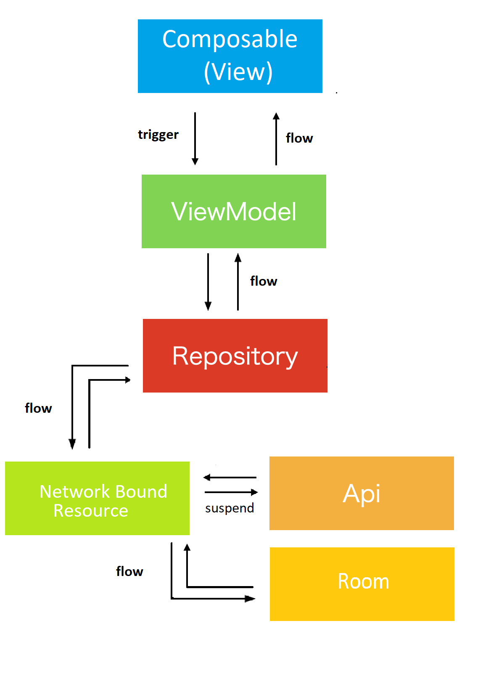

# RepoSearchWithComposeAndFlow
A sample Github RepoSearch app using Android Compose as it's UI, Kotlin StateFlow &amp; SharedFlow as its data flow, Dagger Hilt as it's dependency injection and MVVM architect.

## Screenshot
Watch screen flow in RepoSearch app at [youtube ](https://youtu.be/dl--0XoV7vs).
repo list|repo search|detail
:--:|:--:|:--:
||

## Architecture


### SharedFlow usage in repo list
Call a ViewModel function, and emit to [MutableSharedFlow](https://kotlin.github.io/kotlinx.coroutines/kotlinx-coroutines-core/kotlinx.coroutines.flow/-mutable-shared-flow/).

After transformed to hot stream with [ViewModelScope](https://developer.android.com/topic/libraries/architecture/coroutines#viewmodelscope), 
collect safely it with collectAsStateLifecycleAware in Composable View.

```kotlin
@HiltViewModel
class HomePageViewModel @Inject constructor(savedStateHandle: SavedStateHandle, repository: AppRepository):
  ViewModel() {

  val TAG: String = "HomePageViewModel"
  private val login: String = savedStateHandle.get<String>("login").orEmpty()

  val userName = MutableStateFlow(login)
  private val responseSharedFlow = MutableSharedFlow<Unit>()

  @OptIn(ExperimentalCoroutinesApi::class)
  val responseResource = responseSharedFlow
    .map { userName.value }
    .flatMapLatest { repository.getRepoList(it) }
    .stateIn(viewModelScope, SharingStarted.Eagerly, Resource.Loading)
}
```

```kotlin
@Composable
fun HomePage(
  navHostController: NavHostController,
  homePageViewModel: HomePageViewModel,
  scaffoldState: ScaffoldState = rememberScaffoldState()
) {
  val userName by homePageViewModel.userName.collectAsStateLifecycleAware(initial = "")
  val errorMessage by homePageViewModel.errorMessage.collectAsStateLifecycleAware(initial = "")
  val resource by homePageViewModel.responseResource.collectAsStateLifecycleAware(initial = Resource.Loading)
}

```

### StateFlow usage in Repo Detail 
Use kotlin coroutines flow with [StateFlow](https://kotlin.github.io/kotlinx.coroutines/kotlinx-coroutines-core/kotlinx.coroutines.flow/-state-flow/).

After transformed to hot stream with [ViewModelScope](https://developer.android.com/topic/libraries/architecture/coroutines#viewmodelscope), 
collect it using normal collectAsState in Composable.


```kotlin
@HiltViewModel
class RepoDetailPageViewModel @Inject constructor(
  private val savedStateHandle: SavedStateHandle,
  private val userRepository: AppRepository
) :
  ViewModel() {

  private val login = savedStateHandle.get<String>("login")
  private val _userName = MutableStateFlow(login!!)

  private val repoName = savedStateHandle.get<String>("repoName")
  private val _repoName = MutableStateFlow(repoName!!)

  private val submitEvent = MutableSharedFlow<Unit>()

  @OptIn(ExperimentalCoroutinesApi::class)
  private val resource = submitEvent
    .map { _userName.value }
    .flatMapLatest { userRepository.getRepoDetail(it, _repoName.value) }
    .stateIn(viewModelScope, SharingStarted.Eagerly, Resource.Loading)}

```
```kotlin

@Composable
fun RepoDetailPage(navHostController: NavHostController, repoDetailViewModel: RepoDetailPageViewModel) {

  val isLoading by repoDetailViewModel.isLoading.collectAsState(initial = true)
  val repo by repoDetailViewModel.data.collectAsState(initial = Repo())
  val isFail by repoDetailViewModel.isFail.collectAsState(initial = true)
  val errorMessage by repoDetailViewModel.errorMessage.collectAsState("")

  Scaffold(topBar = {
    RepoDetailAppBar(
      onBackClick = {
        navHostController.popBackStack()
      }
    )
  }) {
    if (isLoading) {
      LoadingScreen()
    } else if (isFail) {
      ErrorScreen(errorMessage = errorMessage, onRetryClick = { repoDetailViewModel.retry() })
    } else {
      repo?.let {
        Card(
          modifier = Modifier
            .padding(10.dp)
            .fillMaxWidth()
            .wrapContentHeight()
        )
      }
    }
  }
}
```
### StateFlow usage in Repo Search
Use kotlin coroutines flow with [StateFlow](https://kotlin.github.io/kotlinx.coroutines/kotlinx-coroutines-core/kotlinx.coroutines.flow/-state-flow/).

After transformed to hot stream with [ViewModelScope](https://developer.android.com/topic/libraries/architecture/coroutines#viewmodelscope),
collect it using normal collectAsState in Composable.


```kotlin
@HiltViewModel
class SearchBoxViewModel @Inject constructor(private val userRepository: AppRepository) : ViewModel() {

  private var allUsers: ArrayList<User> = ArrayList<User>()

  private val searchText: MutableStateFlow<String> = MutableStateFlow("")
  private var showProgressBar: MutableStateFlow<Boolean> = MutableStateFlow(false)
  private var matchedUsers: MutableStateFlow<List<User>> = MutableStateFlow(arrayListOf())

  val userSearchModelState = combine(
    searchText,
    matchedUsers,
    showProgressBar
  ) { text, matchedUsers, showProgress ->

    SearchBoxViewModelState(
      text,
      matchedUsers,
      showProgress
    )
  }
}


```
```kotlin
@ExperimentalComposeUiApi
@ExperimentalAnimationApi
@Composable
fun SearchBoxPage(navHostController: NavHostController, userSearchViewModel: SearchBoxViewModel) {

  val userSearchModelState by userSearchViewModel.userSearchModelState.collectAsState(initial = SearchBoxViewModelState.Empty)

  SearchBoxView(
    searchText = userSearchModelState.searchText,
    placeholderText = "Search user",
    onSearchTextChanged = { userSearchViewModel.onSearchTextChanged(it) },
    onClearClick = { userSearchViewModel.onClearClick() },
    onNavigateBack = {
      navHostController.popBackStack()
    },
    showProgress = userSearchModelState.showProgressBar,
    matchesFound = userSearchModelState.users.isNotEmpty()
  ) {
    LazyColumn(
      modifier = Modifier.fillMaxWidth(),
      contentPadding = PaddingValues(5.dp)
    ) {
    }
  }
}

```


## Libraries
* [kotlin](https://kotlinlang.org/)
    * [kotlin coroutines](https://github.com/Kotlin/kotlinx.coroutines)
* [material-components](https://github.com/material-components/material-components-android)
* [coil](https://github.com/coil-kt/coil)
* [retrofit](https://github.com/square/retrofit)
* [okhttp](https://github.com/square/okhttp)
* [hilt](https://dagger.dev/hilt/)

### Reference Articles
  * [lifecycle aware viewmodel 1](https://betterprogramming.pub/empowered-lifecycle-aware-viewmodel-for-android-f495de9a8170)
  * [lifecycle aware viewmodel 2](https://betterprogramming.pub/jetpack-compose-with-lifecycle-aware-composables-7bd5d6793e0)
  * [lifecycle aware viewmodel 3](https://proandroiddev.com/how-to-collect-flows-lifecycle-aware-in-jetpack-compose-babd53582d0b)
  * [stateflow-transformations](https://proandroiddev.com/clean-stateflow-transformations-in-kotlin-608f4c7de5ab)
  * [stateflow-vs-sharedflow](https://www.valueof.io/blog/stateflow-vs-sharedflow-jetpack-compose)
    
