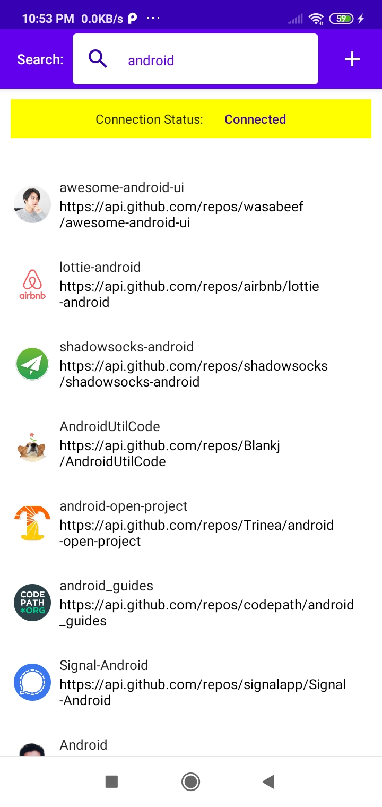
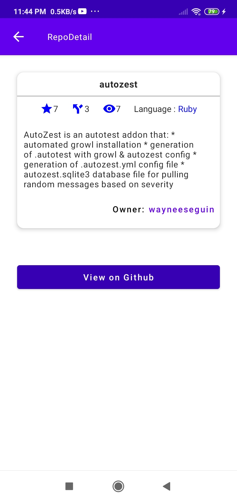

# RepoSearchWithComposeAndFlow
A sample Github RepoSearch app using Android Compose as it's UI, Kotlin StateFlow &amp; SharedFlow as its data flow, Dagger Hilt as it's dependency injection, Room for offline cache and MVVM architect.

## Screenshot
Watch screen flow in RepoSearch app at [youtube ](https://youtu.be/gTqd15aBa1o).
repo list|repo search|detail
:--:|:--:|:--:
||

## Architecture


### SharedFlow usage in HomePage repo list
Call a ViewModel function, and emit to [MutableSharedFlow](https://kotlin.github.io/kotlinx.coroutines/kotlinx-coroutines-core/kotlinx.coroutines.flow/-mutable-shared-flow/).

After transformed to hot stream with [ViewModelScope](https://developer.android.com/topic/libraries/architecture/coroutines#viewmodelscope), 
collect safely it with collectAsStateLifecycleAware in Composable View.

```kotlin
@HiltViewModel
class HomePageViewModel @Inject constructor(savedStateHandle: SavedStateHandle, repository: AppRepository):
  ViewModel() {

  val TAG: String = "HomePageViewModel"
  private val repoName: String = savedStateHandle.get<String>("repo_name").orEmpty()

  val searchText: MutableStateFlow<String> = MutableStateFlow(repoName)

  private val repoListNBRSharedFlow = MutableSharedFlow<Unit>()

  @Suppress("OPT_IN_IS_NOT_ENABLED")
  @OptIn(ExperimentalCoroutinesApi::class)
  var repoListNBR = repoListNBRSharedFlow
    .map { searchText.value }
    .flatMapLatest { repository.getRepoListNetworkBoundResource(it) }
    .stateIn(viewModelScope, SharingStarted.Eagerly, Resource.Loading)

  init {

    Log.e(tag, "init");
    Log.e(tag, "Argument: $repoName")
    Log.e(tag, "SearchText: ${searchText.value}")

    submit()

  }
}

```

```kotlin
@Composable
fun HomePage(
  navHostController: NavHostController,
  homePageViewModel: HomePageViewModel,
  scaffoldState: ScaffoldState = rememberScaffoldState()
) {
  val searchText by homePageViewModel.searchText.collectAsStateLifecycleAware(initial = "")
  val repoListNBR by homePageViewModel.repoListNBR.collectAsStateLifecycleAware()

  var isLoading = false
  var errorMessage = ""
  var repoList: List<Repo> = listOf()


  when (repoListNBR) {
    Resource.Loading -> {
      Log.e(TAG, "NWBR Loading")
      isLoading = repoListNBR.isLoading
    }
    Resource.Fail("") -> {
      Log.e(TAG, "NWBR  Fail")
      errorMessage = repoListNBR.errorMessage.orEmpty()
    }
    else -> {
      Log.e(TAG, "NWBR Success")
      repoList = repoListNBR.data.orEmpty()
    }
  }
}

```

### SharedFlow usage in KeywordSearchPage keyword list
Call a ViewModel function, and emit to [MutableSharedFlow](https://kotlin.github.io/kotlinx.coroutines/kotlinx-coroutines-core/kotlinx.coroutines.flow/-mutable-shared-flow/).

After transformed to hot stream with [ViewModelScope](https://developer.android.com/topic/libraries/architecture/coroutines#viewmodelscope),
collect safely it with collectAsStateLifecycleAware in Composable View.

```kotlin
@HiltViewModel
class KeywordSearchPageViewModel @Inject constructor(
  private val appRepository: AppRepository,
  savedStateHandle: SavedStateHandle,
) : ViewModel() {

  private val tag: String = "KeywordPageViewModel"
  private val repoName: String = savedStateHandle.get<String>("repo").orEmpty()

  val searchText: MutableStateFlow<String> = MutableStateFlow(repoName)


  private val keywordListShareFlow = MutableSharedFlow<Unit>()

  @Suppress("OPT_IN_IS_NOT_ENABLED")
  @OptIn(ExperimentalCoroutinesApi::class)
  var keywordListNBR = keywordListShareFlow
    .map { searchText.value }
    .flatMapLatest { appRepository.getKeywordListNetworkBoundResource(it) }
    .stateIn(viewModelScope, SharingStarted.Eagerly, Resource.Loading)

  init {

    Log.e(tag, "init")
    Log.e(tag, "Argument: $repoName")
    Log.e(tag, "SearchText: ${searchText.value}")

    submit()

  }
}


```
```kotlin

@Composable
fun KeywordSearchPage(navHostController: NavHostController, keywordSearchPageViewModel: KeywordSearchPageViewModel) {

  val searchText by keywordSearchPageViewModel.searchText.collectAsStateLifecycleAware(initial = "")
  val keywordListNBR by keywordSearchPageViewModel.keywordListNBR.collectAsStateLifecycleAware()

  var isLoading = false
  var errorMessage = ""
  var keywordList: List<Keyword> = listOf()


  when (keywordListNBR) {
    Resource.Loading -> {
      Log.e(TAG, "keywordListNBR Loading")
      isLoading = keywordListNBR.isLoading
    }
    Resource.Fail("") -> {
      Log.e(TAG, "keywordListNBR  Fail")
      errorMessage = keywordListNBR.errorMessage.orEmpty()
    }
    else -> {
      Log.e(TAG, "keywordListNBR Success")
      keywordList = keywordListNBR.data.orEmpty()
      when (keywordListNBR.data.isNullOrEmpty()) {
        true -> Log.e(TAG, "keyword list : NullOrEmpty")
        else -> {
          Log.e(TAG, "first keyword : ${keywordList.first().name}")
        }

      }

    }
  }
}

```
### Using Room and Network Bound Resource for offline cache 
Use kotlin coroutines flow with [StateFlow](https://kotlin.github.io/kotlinx.coroutines/kotlinx-coroutines-core/kotlinx.coroutines.flow/-state-flow/).

After transformed to hot stream with [ViewModelScope](https://developer.android.com/topic/libraries/architecture/coroutines#viewmodelscope),
collect it using normal collectAsState in Composable.


```kotlin
@TypeConverters(Converters::class)
@Database(entities = [Repo::class, Keyword::class], version = 1, exportSchema = false)
abstract class RepoSearchDatabase() : RoomDatabase() {

  abstract fun repoDao(): RepoDao

  abstract fun keywordDao(): KeywordDao

}

```
```kotlin
@Dao
interface RepoDao {

  @Insert(onConflict = OnConflictStrategy.REPLACE)
  suspend fun insertAll(repos: List<Repo>)

  @Query("DELETE FROM Repos")
  suspend fun deleteAll()

  @Query("SELECT * FROM Repos WHERE name IN (:userNames)")
  fun getRepos(userNames: String): Flow<List<Repo>>
}

```
```kotlin
class RepoSearchAppRepository @Inject constructor(
  private val apiDataSource: RestDataSource,
  private val dbDataSource: RepoSearchDatabase
): AppRepository {

  private val keywordDao = dbDataSource.keywordDao()
  private val repoDao = dbDataSource.repoDao()

  @OptIn(FlowPreview::class)
  override fun getRepoListNetworkBoundResource(s: String): Flow<Resource<List<Repo>>> =
    networkBoundResource(
      query = {
        repoDao.getRepos(s)
      },
      fetch = {
        Log.e("Repository", "in fetch(): Repos")
        val apiRepos = apiDataSource.searchRepos(s).items
        Log.e("Repository", "all apiRepos size ${apiRepos.size}")

        apiRepos

      },
      filterFetch = { cachedRepos, apiRepos ->
        apiRepos.flatMap { repos ->
          cachedRepos.filter {
            repos.id != it.id
          }.toList()
          apiRepos
        }
      },

      saveFetchResult = { repos ->
        dbDataSource.withTransaction {
          repoDao.insertAll(repos)
        }
      },

      shouldFetch = { repos ->
        //repos.none { repo -> repo.name.compareTo(s, false) ==0 }
        repos.isEmpty()
      }
    )
}

```


## Libraries
* [kotlin](https://kotlinlang.org/)
    * [kotlin coroutines](https://github.com/Kotlin/kotlinx.coroutines)
* [material-components](https://github.com/material-components/material-components-android)
* [coil](https://github.com/coil-kt/coil)
* [retrofit](https://github.com/square/retrofit)
* [okhttp](https://github.com/square/okhttp)
* [hilt](https://dagger.dev/hilt/)

### Reference Articles
  * [lifecycle aware viewmodel 1](https://betterprogramming.pub/empowered-lifecycle-aware-viewmodel-for-android-f495de9a8170)
  * [lifecycle aware viewmodel 2](https://betterprogramming.pub/jetpack-compose-with-lifecycle-aware-composables-7bd5d6793e0)
  * [lifecycle aware viewmodel 3](https://proandroiddev.com/how-to-collect-flows-lifecycle-aware-in-jetpack-compose-babd53582d0b)
  * [stateflow-transformations](https://proandroiddev.com/clean-stateflow-transformations-in-kotlin-608f4c7de5ab)
  * [stateflow-vs-sharedflow](https://www.valueof.io/blog/stateflow-vs-sharedflow-jetpack-compose)

    
